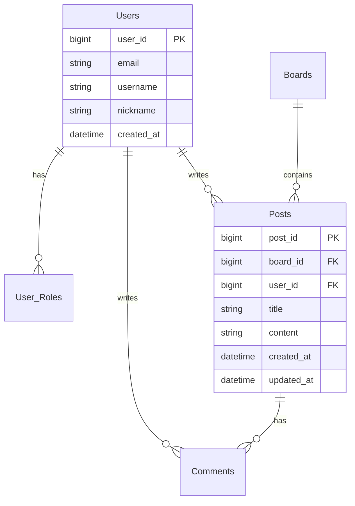
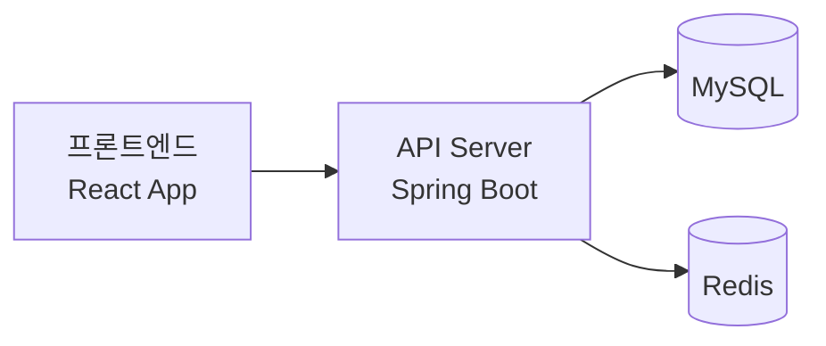

<div align="center">
  
# 🍯 허니보드 API 서버

[](https://spring.io/projects/spring-boot)
[](https://www.oracle.com/java/)
[](https://www.mysql.com/)
[](https://www.docker.com/)

React 기반 프론트엔드와 연동되는 RESTful API 서버입니다.  
게시판 기능을 제공하며, 사용자들이 자유롭게 소통할 수 있는 플랫폼을 위한 백엔드를 제공합니다.

</div>

## 📱 연관 프로젝트
- 프론트엔드: [honeyboard-client](https://github.com/honeyboard-client)
  - React 18 기반의 웹 클라이언트
  - Material-UI를 활용한 반응형 디자인
  - Redux를 통한 상태 관리

## 👥 팀원 소개
<table>
  <tr>
    <td align="center"><a href="https://github.com/zyu22"><br /><sub><b>zyu22</b></sub></a><br />👑 백엔드 팀장<br/><a href="https://github.com/zyu22"></a></td>
    <td align="center"><a href="https://github.com/kkangssu"><br /><sub><b>kkangssu</b></sub></a><br />🔨 백엔드 개발<br/><a href="https://github.com/kkangssu"></a></td>
    <td align="center"><a href="https://github.com/rpeowiqu"><br /><sub><b>rpeowiqu</b></sub></a><br />🔨 백엔드 개발<br/><a href="https://github.com/rpeowiqu"></a></td>
    <td align="center"><a href="https://github.com/yujeong789"><br /><sub><b>yujeong789</b></sub></a><br />🔨 백엔드 개발<br/><a href="https://github.com/yujeong789"></a></td>
  </tr>
</table>

## 🛠 기술 스택

<table>
  <tr>
    <td align="center">백엔드</td>
    <td>
      
      
      
      
    </td>
  </tr>
  <tr>
    <td align="center">데이터베이스</td>
    <td>
      
      
    </td>
  </tr>
  <tr>
    <td align="center">인프라</td>
    <td>
      
      
      
    </td>
  </tr>
</table>

## 📋 API 명세(수정중-추후 노션주소도 포함될 예정)

상세 API 문서는 Swagger UI를 통해 제공됩니다: [API문서](/swagger-ui/index.html)

## 📋 데이터베이스 설계 (수정중)

### ERD


## 🚀 주요 기능

### 👤 인증 및 보안
- JWT 기반 인증
- Spring Security를 활용한 보안
- OAuth2.0 소셜 로그인
  - 구글 로그인 연동
  - 카카오 로그인 연동
  - 네이버 로그인 연동
- 소셜 계정과 로컬 계정 통합 관리

### 📝 API 기능
- RESTful API 설계
- 게시판/게시글/댓글 CRUD
- 페이징 및 검색
- 파일 업로드

### 🔍 성능 최적화
- 페이징 처리 최적화

## 💻 로컬 개발 환경 설정

### 필수 요구사항
```
- JDK 17
- Maven
- MySQL 8.0
- Docker (선택사항)
```

### 설치 및 실행

1. 저장소 복제
```bash
git clone https://github.com/zyu22/honeyboard-server.git
cd honeyboard-server
```

2. 환경 설정
```bash
cp src/main/resources/application.properties.example src/main/resources/application.properties
# 데이터베이스, Redis 등 설정 수정
```

3. 실행
```bash
mvn spring-boot:run
```

### 도커 실행
```bash
docker-compose up -d
```

## 📜 개발 규칙

### Git 브랜치 전략
```
main (배포용)
└── develop (개발용)
    ├── feat/* (기능 개발)
    └── fix/* (버그 수정)
```

### 커밋 메시지
```
feat: 새로운 기능 추가
fix: 버그 수정
docs: 문서 수정
refactor: 코드 리팩토링
test: 테스트 코드
chore: 기타 변경사항
```

## 🌐 배포 구조

<div align="center">



</div>

- GitHub Actions를 통한 자동 배포
- AWS EC2에 Docker로 운영
- NGINX를 통한 리버스 프록시

## ⏳ 개발 진행 상황

<div align="center">

| 단계 | 상태 |
|------|------|
| 프로젝트 설정 | ✅ |
| DB 설계 | ✅ |
| API 문서 작성 | 🏗 |
| 사용자 인증 | 🏗 |
| 게시판 API | 📝 |
| 배포 구성 | 📝 |

</div>

---
<div align="center">
  
허니보드 백엔드 팀이 만든 ❤️ 프로젝트

</div>
